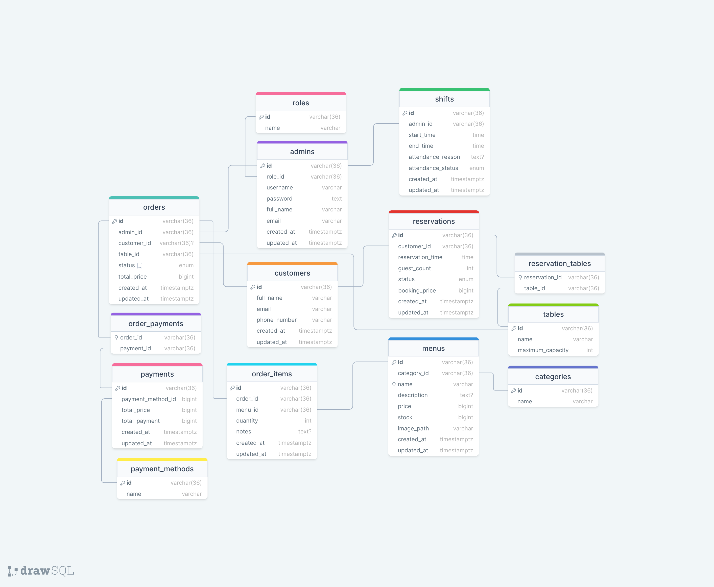

# Soal Teori
Berikut adalah Schema Database dan Tech Stack yang sudah saya tentukan untuk studi kasus Aplikasi Restoran.

## Schema Database Aplikasi Restoran

## Tech Stack

1. **Bahasa Pemrograman Go:** Saya memilih Go karena bahasa ini dikenal karena kinerjanya yang tinggi, kemudahan dalam mengelola konkurrensi, dan pengelolaan memori yang efisien.

2. **Basis Data MySQL:** MySQL adalah pilihan yang andal dan terkenal dalam pengelolaan data terstruktur, yang sesuai untuk aplikasi yang memerlukan keamanan dan stabilitas.

3. **API dan Web Services RESTful:** RESTful API adalah standar industri untuk komunikasi web yang mudah dimengerti dan dioptimalkan untuk kinerja tinggi.

4. **Framework Gin:** Saya memilih Gin karena itu adalah framework Go yang ringan, cepat, dan mudah dipahami, yang mempercepat pengembangan.

5. **ORM/Raw Query menggunakan Squirrel:** Squirrel adalah pustaka yang memudahkan penggunaan raw query, memberikan fleksibilitas dalam mengelola database dan kinerja yang optimal.

6. **Pembayaran Online Midtrans:** Midtrans adalah platform pembayaran terkemuka yang menyediakan berbagai metode pembayaran yang fleksibel, memudahkan pengalaman pelanggan.

7. **Repository GitLab:** Saya memilih GitLab karena itu adalah platform pengembangan yang kuat, dengan dukungan CI/CD yang terintegrasi dan kontrol versi yang efisien.

8. **CI/CD Jenkins:** Jenkins adalah alat CI/CD yang andal dan dapat dikonfigurasi, yang memungkinkan otomatisasi pengujian dan penyebaran aplikasi.

9. **Dokumentasi API Postman:** Postman adalah alat yang mempermudah dokumentasi dan pengujian API, yang memungkinkan pengembang untuk berkolaborasi secara lebih efisien.
